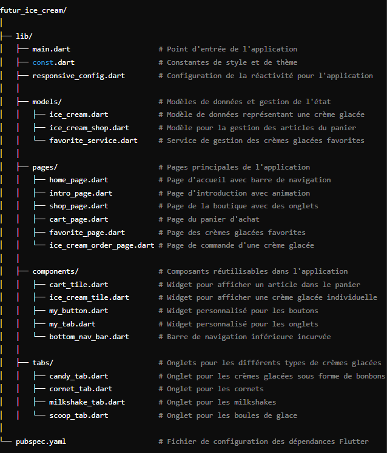

# Application Flutter - Gestion de Crème Glacée

## Introduction

Futur Ice Cream est conçue pour gérer un magasin de crème glacée. Elle permet aux utilisateurs de parcourir différentes catégories de crèmes glacées, d'ajouter des articles à leur panier, de passer des commandes, et d'explorer diverses autres fonctionnalités liées au magasin.

## Architecture de l'Application

### Structure des Fichiers

L'application est organisée de manière modulaire pour faciliter la maintenance et la réutilisation des composants. Voici un aperçu des fichiers principaux :

### Navigation

L'application utilise le widget `Navigator` de Flutter pour gérer la navigation entre les différentes pages. Chaque page est un `Widget` indépendant qui peut être appelé à partir d'autres pages via `Navigator.push` ou `Navigator.pushReplacement`.

## Pages Principales

### Home Page

La page d'accueil (`home_page.dart`) présente une vue générale de l'application, avec un accès rapide aux différentes catégories de produits et aux autres pages principales.

### Shop Page

La page du magasin (`shop_page.dart`) affiche tous les produits disponibles, triés par catégorie. Les utilisateurs peuvent ajouter des produits à leur panier depuis cette page.

### Cart Page

La page du panier (`cart_page.dart`) affiche tous les articles que l'utilisateur a ajoutés au panier. L'utilisateur peut  retirer des articles avant de passer à la caisse.

### Ice Cream Order Page

La page de commande de crème glacée (`ice_cream_order_page.dart`) permet aux utilisateurs de personnaliser leur commande avant de valider la commande.

### Intro Page

La page d'introduction (`intro_page.dart`) est probablement la première page que l'utilisateur voit lorsqu'il ouvre l'application. Elle peut inclure une animation ou un message de bienvenue avant de naviguer vers la page d'accueil.

## Widgets Personnalisés

### MyButton

Un bouton générique et réutilisable (`my_button.dart`) pour diverses actions dans l'application, telles que "Payer maintenant" ou "Ajouter au panier".

### MyTab

Un widget d'onglet personnalisé (`my_tab.dart`) utilisé dans les sections de navigation par onglets. Chaque onglet affiche une icône.

### IceCreamTile

Un widget (`ice_cream_tile.dart`) pour afficher une tuile de crème glacée, avec son image, son nom, et d'autres détails pertinents.

### CartTile

Un widget (`cart_tile.dart`) pour afficher une tuile d'article dans le panier, avec des options pour modifier la quantité ou supprimer l'article.

### BottomNavBar

Une barre de navigation inférieure (`bottom_nav_bar.dart`) pour naviguer entre les principales sections de l'application.

## Modèles et Onglets Spécifiques

### Modèles

- **IceCream** (`ice_cream.dart`): Représente un modèle de crème glacée avec des propriétés telles que le nom, la description, le prix, etc.
- **IceCreamShop** (`ice_cream_shop.dart`): Représente les fonctions & liste des crèmes glacées

### Onglets

Les fichiers d'onglets (`candy_tab.dart`, `cornet_tab.dart`, `milkshake_tab.dart`, `scoop_tab.dart`) représentent différentes catégories de produits dans l'application. Ces onglets sont utilisés dans la `Shop Page` pour filtrer les produits par type.

---
## Téléchargement de l'APK

Vous pouvez télécharger la dernière version de l'application Android [ici](release/app-release.apk).

Pour installer l'APK :
1. Téléchargez le fichier APK depuis le lien ci-dessus.
2. Ouvrez le fichier APK sur votre appareil Android.
3. Suivez les instructions pour installer l'application.

_Note : Vous devrez peut-être autoriser l'installation d'applications à partir de sources inconnues dans les paramètres de votre appareil._

